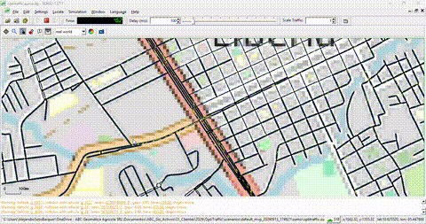

<p align="center">
  
</p>

# OptiTraffic

[](https://github.com/asoto59g/OptiTraffic)
[](https://www.python.org/)
[](https://streamlit.io/)
[](https://eclipse.dev/sumo/)
[](https://developer.tomtom.com/)
[](https://www.openstreetmap.org/copyright)
[](https://download.geofabrik.de/)
[](https://github.com/asoto59g/OptiTraffic/commits)
[](https://github.com/asoto59g/OptiTraffic)

Simulador de tráfico vehicular urbano para evaluar mejoras en **semáforos**, **sentidos**, **parqueo** y **señales de alto**, calibrado con tráfico real TomTom y red OSM.

**Stack:** Streamlit + Python + [SUMO](https://eclipse.dev/sumo/) + TomTom Traffic Flow (freemium) + OpenStreetMap (Overpass / Geofabrik).

**Repo:** https://github.com/asoto59g/OptiTraffic

---

## Requisitos

1. **Python 3.10+**
2. **SUMO** instalado y `SUMO_HOME` definido  
   - Windows (ejemplo): `C:\Program Files (x86)\Eclipse\Sumo`
   ```powershell
   $env:SUMO_HOME = "C:\Program Files (x86)\Eclipse\Sumo"
   $env:Path = "$env:SUMO_HOME\bin;$env:Path"
   ```
3. **Clave TomTom** (recomendado): [developer.tomtom.com](https://developer.tomtom.com/) — freemium (~200k vector tiles/mes)

---

## Instalación

```powershell
cd OptiTraffic
python -m venv .venv
.\.venv\Scripts\Activate.ps1
pip install -r requirements.txt
pip install -r requirements-dev.txt
copy .env.example .env
# Edite .env: TOMTOM_API_KEY=... y SUMO_HOME=...
```

Licencia del código: MIT (`LICENSE`). Datos OSM © colaboradores (ODbL); Geofabrik y TomTom según sus términos.

## Ejecutar

```powershell
streamlit run app.py
# o: python -m streamlit run app.py
```

---

## Flujo del wizard (6 pasos)

| Paso | Qué hace |
|------|----------|
| **1. Zona** | Ciudad + **país en lista** (Geofabrik), geocodificación, rectángulo/dibujo/GeoJSON (máx. ~25 km²). Preview del extracto. |
| **2. Red OSM→SUMO** | Overpass (rápido) o Geofabrik (país, **tope 500 MB**) → recorte → `netconvert` → mapa de edges. |
| **3. Configuración** | Clic en **cruces** (semáforos) o **calles** (alto/parqueo/carriles). En **opciones extra**: dirección de flujo (avenida O→E/E→O, calle N→S/S→N). Guardar/cargar config ligada al polígono. |
| **4. TomTom** | Flow tiles o **calibración sintética** (CR sin cobertura TomTom Flow). |
| **5. Simulación** | **Entradas/salidas** de flujo + warmup; demanda OD; duración larga; KPIs; fondo OSM/satélite en sumo-gui; opcional **Grabar video (sumo-gui)** → PNG + MP4 (ffmpeg). |
| **6. Resultados** | Mapa de congestión, CSV/GeoJSON, guardar escenario portable (`sumo/`). |

---

## Modelo de tráfico (parámetros urbanos)

Definidos en `src/traffic_params.py`:

| Parámetro | Valor |
|-----------|--------|
| Velocidad máxima urbana | **40 km/h** (~11.11 m/s) |
| Largo promedio vehículo | **5.0 m** + gap 2.5 m |
| Congestión (KPI) | media &lt; ~20 km/h |
| Capacidad | tope de escenario **y** capacidad física (Greenshields / espacio del tramo) |

**Densidad por escenario (por sentido):**

| Escenario | Por sentido | Ambos sentidos (ref.) |
|-----------|-------------|------------------------|
| Bajo | 150–200 veh/h | 300–400 |
| Medio | 250–350 veh/h | 500–700 |
| Alto | 400–500 veh/h | 800–1.000 |

En hora pico, TomTom **reduce la velocidad permitida del tramo** (no solo sube la demanda).

**Sentidos OSM:** se respetan `oneway` de OpenStreetMap. El mapa muestra un sentido (azul oscuro + flechas) vs doble sentido. Si OSM no trae `oneway=yes`, SUMO modela doble sentido.

**Avenidas / calles (Costa Rica):** por bearing del edge se clasifica eje E–O (avenida) o N–S (calle) y la dirección de circulación de ese edge SUMO: **O→E**, **E→O**, **N→S** o **S→N**. En el paso 3 (opciones extra) se muestra el valor detectado y se puede corregir manualmente (`flow_dir` / `flow_dir_user` en las propiedades del edge).

---

## Datos OSM (Overpass / Geofabrik)

- **Auto:** Overpass primero; si falla → Geofabrik + osmium.
- **Solo Overpass:** ideal para polígonos pequeños.
- **Solo Geofabrik:** extracto de país. Tope por defecto **500 MB** (`OPTITRAFFIC_MAX_PBF_MB`). País del paso 1 vía lista + ISO/`index-v1.json` (fallback `COUNTRY_EXTRACTS`).
- Rutas con acentos (OneDrive “Geomática”) se copian a `%LOCALAPPDATA%\OptiTraffic\` para herramientas nativas.

---

## Escenarios guardados

Al terminar la configuración (paso 3) o en resultados (paso 6):

- Se guarda **polígono + semáforos/altos/parqueos/carriles + red + edges** en `scenarios/<nombre>_fecha/`.
- En paso 6 se empaqueta un proyecto SUMO portable en `sumo/` (`optitraffic.sumocfg` relativo, rutas, red, KPIs; fondo OSM/satélite si se generó).
- Se puede **sobrescribir** por nombre.
- Carga desde el paso 3 (configs del mismo polígono, IoU ≥ 85%) o desde la **barra lateral**.
- Los escenarios locales no se suben a git (`scenarios/*/` en `.gitignore`).

---

## Estructura del proyecto

```
app.py                 # Orquestador Streamlit (sidebar + despacho)
ui/                    # Pasos del wizard (zona, red, config, tomtom, sim, resultados)
src/
  area.py              # Zona, Nominatim (caché + rate-limit), GeoJSON
  osm_fetch.py         # Overpass / Geofabrik (+ tope PBF, index-v1)
  network_build.py     # netconvert, edges GeoJSON, tope 40 km/h
  editors.py           # TLS / parking / stops / lanes / roles avenida-calle + flow_dir
  tomtom.py            # Flow tiles + STRtree match + sintético
  flow_gates.py        # Entradas/salidas de demanda OD
  demand.py            # Demanda + escenarios de densidad
  traffic_params.py    # 40 km/h, 5 m, capacidad espacial
  simulate.py          # TraCI, KPIs, warmup
  sumo_background.py   # Teselas OSM / satélite para sumo-gui
  viz.py               # Folium
  scenarios.py         # Guardar / cargar config (+ paquete sumo/)
  wizard_state.py      # Estado tipado del wizard
  logging_config.py    # Logging central
tests/                 # pytest (sin SUMO/TomTom por defecto)
.github/workflows/ci.yml
pyproject.toml
LICENSE                # MIT
requirements.txt
requirements-dev.txt   # pytest, ruff
```

### Desarrollo / CI

```powershell
pip install -r requirements-dev.txt
pytest -q -m "not integration"
ruff check src ui tests app.py scripts
```

---

## Notas operativas

- **TraCI:** si aparece `Connection already active` o `Connection closed by SUMO`, recargue la app y cierre procesos `sumo.exe` huérfanos. Los semáforos adicionales usan fases reales del `.net.xml` (no estados inventados de longitud fija).
- **Mapa de configuración:** la lentitud al confirmar no depende de Geofabrik; se usa una red simplificada en Folium.
- Áreas grandes ralentizan `netconvert` y la simulación; mantenga el polígono pequeño en el MVP.
- No suba `.env` ni claves TomTom al repositorio.

---

## Changelog reciente (post-MVP inicial)

- Dirección de flujo en opciones extra (paso 3): avenida O→E/E→O y calle N→S/S→N, con override manual.
- Fondo OSM/satélite en sumo-gui; proyectos SUMO portables al guardar; default 1 carril + parqueo derecho.
- TLS/altos reales en la red; demanda ordenada por `depart`; preload con puertas de flujo.
- Hardening: `ui/` modular, pytest + GitHub Actions, LICENSE MIT, logging.
- Nominatim con caché/rate-limit; Geofabrik vía index + tope PBF 500 MB; país en selectbox.
- Puertas entrada/salida + simulación larga con warmup; TomTom sintético si no hay cobertura (CR).
- `match_traffic_to_edges` con STRtree; pipeline OSM ASCII-safe en Windows.
- Modelo 40 km/h, topes Bajo/Medio/Alto, escenarios ligados al polígono.

---

## Licencia de datos

- Mapas: © [OpenStreetMap](https://www.openstreetmap.org/copyright) contributors.
- Extractos: [Geofabrik](https://download.geofabrik.de/).
- Tráfico en vivo: TomTom (según términos de su API).
